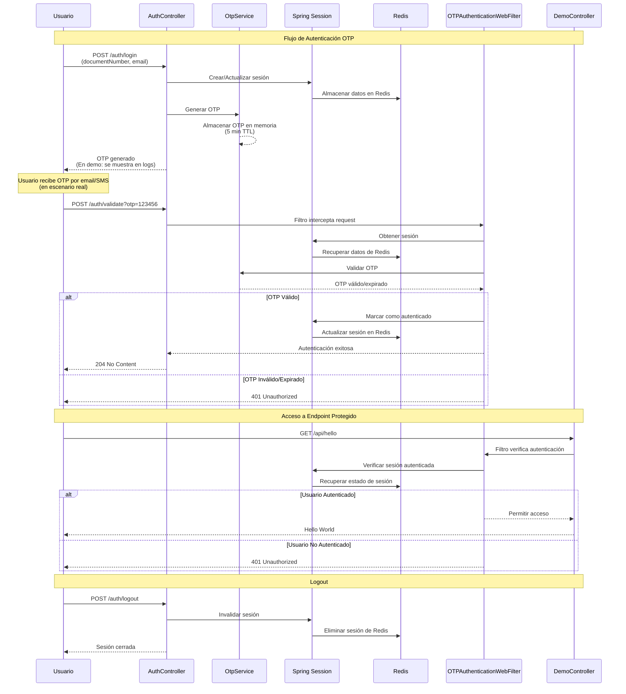
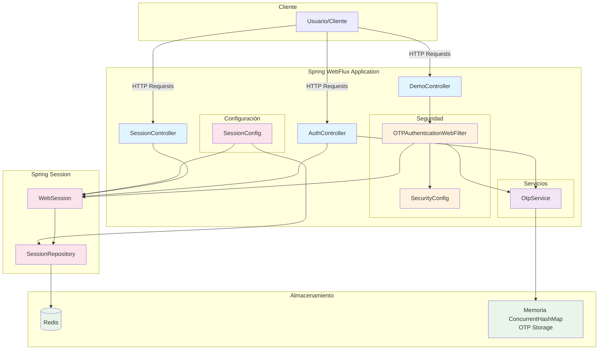

# Spring Web Session con Redis

Una aplicación de **demostración de concepto** de Spring Boot con WebFlux que implementa autenticación basada en OTP (One-Time Password) utilizando Spring Session con Redis para el manejo de sesiones. Este proyecto está diseñado para mostrar la integración de tecnologías reactivas con sistemas de autenticación modernos.

> ⚠️ **Nota**: Este es un proyecto de demostración que requiere mejoras y control de errores robusto para uso en producción.

## 🚀 Características

- **Spring Boot 3.5.4** con WebFlux (programación reactiva)
- **Spring Security** con autenticación personalizada por OTP
- **Spring Session** con Redis para almacenamiento de sesiones
- **Spring Actuator** para monitoreo y métricas
- **Lombok** para reducir código boilerplate
- **Manejo de errores** global con respuestas estructuradas
- **Configuración de seguridad** personalizada con filtros reactivos

## 🏗️ Arquitectura

### Componentes Principales

- **AuthController**: Maneja el flujo de autenticación (login, validación OTP, logout)
- **SessionController**: Proporciona endpoints para gestionar sesiones
- **DemoController**: Endpoint protegido de demostración
- **OtpService**: Genera y valida códigos OTP
- **OTPAuthenticationWebFilter**: Filtro personalizado de autenticación
- **SecurityConfig**: Configuración de seguridad reactiva
- **SessionConfig**: Configuración de Spring Session con Redis

### Flujo de Autenticación

1. **Login**: Usuario proporciona documento y email
2. **Generación OTP**: Se genera un código de 6 dígitos válido por 5 minutos
3. **Envío OTP**: En un escenario real, el OTP se enviaría por email/SMS al usuario
4. **Validación**: Usuario ingresa el OTP recibido para autenticarse
5. **Acceso**: Usuario autenticado puede acceder a endpoints protegidos
6. **Logout**: Invalidación de sesión

### Escenario Real de OTP

En un entorno de producción, el flujo de OTP funcionaría así:

- **Email/SMS**: El OTP se enviaría automáticamente al email o teléfono del usuario
- **Seguridad**: El OTP no se retornaría en la respuesta del endpoint (solo se mostraría en logs para esta demo)
- **Expiración**: Los códigos expiran automáticamente después de 5 minutos
- **Intento único**: Cada OTP es válido para un solo uso

## 🔄 Diagrama de Flujo de Autenticación



### Flujo de Datos en el Sistema



## 🛠️ Tecnologías Utilizadas

| Tecnología | Versión | Propósito |
|------------|---------|-----------|
| Java | 17 | Lenguaje de programación |
| Spring Boot | 3.5.4 | Framework principal |
| Spring WebFlux | 3.5.4 | Programación reactiva |
| Spring Security | 3.5.4 | Seguridad |
| Spring Session | 3.5.4 | Gestión de sesiones |
| Redis | - | Almacenamiento de sesiones |
| Lombok | - | Reducción de código |
| Maven | - | Gestión de dependencias |

## 📋 Prerrequisitos

- Java 17 o superior
- Maven 3.6+
- Redis Server (puerto 6379)

## 🚀 Instalación y Ejecución

### 1. Clonar el repositorio
```bash
git clone <repository-url>
cd spring-web-session-with-redis
```

### 2. Configurar Redis
Asegúrate de que Redis esté ejecutándose en `localhost:6379`. 

**Opción 1 - Docker (Recomendado):**
```bash
docker run -d -p 6379:6379 redis:alpine
```

**Opción 2 - Instalación local:**
- Ubuntu/Debian: `sudo apt install redis-server`
- macOS: `brew install redis`
- Windows: Descargar desde [redis.io](https://redis.io/download)

Verificar que Redis esté funcionando:
```bash
redis-cli ping
# Debe responder: PONG
```

### 3. Ejecutar la aplicación
```bash
mvn spring-boot:run
```

La aplicación estará disponible en `http://localhost:8080`

## 📚 API Endpoints

### Autenticación (`/auth`)

| Método | Endpoint | Descripción | Autenticación |
|--------|----------|-------------|---------------|
| POST | `/auth/login` | Genera OTP para documento y email | No |
| POST | `/auth/validate` | Valida OTP y autentica usuario | No (pero requiere OTP válido) |
| POST | `/auth/status` | Consulta estado de autenticación | No |
| POST | `/auth/logout` | Cierra sesión | No |

### Sesiones (`/api/session`)

| Método | Endpoint | Descripción | Autenticación |
|--------|----------|-------------|---------------|
| GET | `/api/session/info` | Información de la sesión actual | No |
| POST | `/api/session/set` | Establece atributo en sesión | No |
| GET | `/api/session/get` | Obtiene atributo de sesión | No |
| POST | `/api/session/remove` | Elimina atributo de sesión | No |
| POST | `/api/session/invalidate` | Invalida sesión actual | No |

### Demostración (`/api`)

| Método | Endpoint | Descripción | Autenticación |
|--------|----------|-------------|---------------|
| GET | `/api/hello` | Endpoint protegido de demostración | Sí |

### Monitoreo (`/actuator`)

| Método | Endpoint | Descripción | Autenticación |
|--------|----------|-------------|---------------|
| GET | `/actuator/health` | Estado de salud de la aplicación | No |
| GET | `/actuator/info` | Información de la aplicación | No |
| GET | `/actuator/metrics` | Métricas de la aplicación | No |

## 🔧 Configuración

### application.yml

```yaml
server:
  port: 8080

spring:
  application:
    name: spring-web-session-with-redis
  
  data:
    redis:
      host: localhost
      port: 6379
      database: 0
      timeout: 2000ms
  
  session:
    store-type: redis
    redis:
      namespace: "spring:demo:session"
      flush-mode: on_save
    timeout: 30m

management:
  endpoints:
    web:
      exposure:
        include: health,info,metrics
  endpoint:
    health:
      show-details: always
```

### Variables de Entorno

Puedes sobrescribir la configuración usando variables de entorno:

```bash
export SPRING_DATA_REDIS_HOST=localhost
export SPRING_DATA_REDIS_PORT=6379
export SERVER_PORT=8080
```

## 🧪 Pruebas

### Flujo de Autenticación Completo

1. **Login**:
```bash
curl -X POST "http://localhost:8080/auth/login?documentNumber=12345678&email=test@example.com"
```

2. **Validar OTP** (usar el OTP devuelto en el paso anterior):
```bash
curl -X POST "http://localhost:8080/auth/validate?otp=123456" \
  -H "Cookie: SESSION=your-session-id"
```

3. **Acceder a endpoint protegido**:
```bash
curl -X GET "http://localhost:8080/api/hello" \
  -H "Cookie: SESSION=your-session-id"
```

4. **Verificar estado**:
```bash
curl -X POST "http://localhost:8080/auth/status" \
  -H "Cookie: SESSION=your-session-id"
```

5. **Logout**:
```bash
curl -X POST "http://localhost:8080/auth/logout" \
  -H "Cookie: SESSION=your-session-id"
```

### Archivos de Prueba HTTP

El proyecto incluye archivos `.http` para pruebas:

- `test-auth-flow.http`: Flujo completo de autenticación
- `test-endpoints.http`: Pruebas de endpoints
- `test-session.http`: Pruebas de funcionalidad de sesiones

## 🔐 Seguridad

### Configuración de Seguridad

- **CSRF**: Deshabilitado para APIs REST
- **Autenticación**: Basada en OTP con Spring Session
- **Autorización**: Endpoints protegidos requieren autenticación
- **Sesiones**: Almacenadas en Redis con namespace personalizado

### Endpoints Protegidos

- `/api/hello`: Requiere autenticación con `@PreAuthorize("hasRole('USER')")`
- `/auth/validate`: Validación de OTP
- Cualquier endpoint bajo `/api/protected/**`

### Endpoints Públicos

- `/actuator/**`: Monitoreo y métricas
- `/auth/login`, `/auth/status`, `/auth/logout`: Gestión de autenticación
- `/api/session/**`: Gestión de sesiones

## 📊 Monitoreo

### Actuator Endpoints

- **Health**: `/actuator/health` - Estado de salud de la aplicación
- **Info**: `/actuator/info` - Información de la aplicación
- **Metrics**: `/actuator/metrics` - Métricas de rendimiento

### Logs

La aplicación configura logging estructurado:

```yaml
logging:
  level:
    com.example.springwebsession: INFO
    org.springframework.web: DEBUG
  pattern:
    console: "%d{yyyy-MM-dd HH:mm:ss} - %msg%n"
```

## 🏗️ Estructura del Proyecto

```
src/main/java/com/example/springwebsession/
├── config/
│   └── SessionConfig.java           # Configuración de Spring Session
├── controller/
│   ├── AuthController.java          # Controlador de autenticación
│   ├── DemoController.java          # Controlador de demostración
│   └── SessionController.java       # Controlador de sesiones
├── exception/
│   └── GlobalExceptionHandler.java  # Manejador global de excepciones
├── security/
│   ├── OTPAuthenticationWebFilter.java # Filtro de autenticación personalizado
│   └── SecurityConfig.java          # Configuración de seguridad
├── service/
│   └── OtpService.java              # Servicio de OTP
└── SpringWebSessionApplication.java # Clase principal
```

## 🔧 Desarrollo

### Compilación

```bash
mvn clean compile
```

### Empaquetado

```bash
mvn clean package
```

### Ejecución del JAR

```bash
java -jar target/spring-web-session-with-redis-1.0.0.jar
```

### Perfiles de Configuración

Puedes usar diferentes perfiles para diferentes entornos:

```bash
mvn spring-boot:run -Dspring-boot.run.profiles=dev
mvn spring-boot:run -Dspring-boot.run.profiles=prod
```

## 🐛 Solución de Problemas

### Redis Connection Error

Si Redis no está disponible:
```
Error: Unable to connect to Redis
```

**Solución**: Verificar que Redis esté ejecutándose en `localhost:6379`

### Session Not Found

Si las sesiones no persisten:
```
Error: No active session
```

**Solución**: Verificar configuración de Redis y namespace de sesión

### OTP Expired

Si el OTP expira rápidamente:
```
Error: Invalid or expired OTP
```

**Solución**: Los OTP expiran en 5 minutos. Generar uno nuevo con `/auth/login`

## 📝 Notas de Implementación

### Limitaciones Actuales (Proyecto Demo)
- **OTP en memoria**: Los códigos se almacenan en ConcurrentHashMap (no persistente)
- **Sin envío real**: Los OTP se muestran en logs, no se envían por email/SMS
- **Control de errores básico**: Manejo de excepciones simplificado
- **Sin rate limiting**: No hay protección contra ataques de fuerza bruta
- **Logs de seguridad**: Información sensible visible en logs

### Mejoras Necesarias para Producción
- **Almacenamiento persistente**: Mover OTP a Redis con TTL automático
- **Servicio de notificaciones**: Integrar con proveedores de email/SMS
- **Rate limiting**: Implementar límites de intentos por IP/usuario
- **Auditoría**: Logging detallado de eventos de seguridad
- **Validación robusta**: Validación de entrada más estricta
- **Configuración segura**: Variables de entorno para datos sensibles

### Características Actuales Funcionales
- Las sesiones se configuran con timeout de 30 minutos
- El filtro de autenticación maneja tanto validación de OTP como verificación de sesión
- Spring Session con Redis permite escalabilidad horizontal
- Manejo reactivo de todas las operaciones

## 🤝 Contribución

1. Fork el proyecto
2. Crea una rama para tu feature (`git checkout -b feature/AmazingFeature`)
3. Commit tus cambios (`git commit -m 'Add some AmazingFeature'`)
4. Push a la rama (`git push origin feature/AmazingFeature`)
5. Abre un Pull Request

## 📄 Licencia

Este proyecto está bajo la **Licencia Apache 2.0**. Ver el archivo `LICENSE` para más detalles.

### ✅ **Ventajas de Apache 2.0 para tu proyecto privado:**

- **Uso comercial y privado**: Puedes usar este código en proyectos comerciales sin restricciones
- **Modificación libre**: Puedes modificar el código como necesites
- **Licencia diferente**: Puedes distribuir tu proyecto bajo cualquier licencia
- **Solo atribución**: Solo necesitas incluir el archivo de licencia original
- **Sin copyleft**: No estás obligado a usar la misma licencia en tu proyecto

## 👥 Autor

Desarrollado como **proyecto de demostración de concepto** de Spring Boot con WebFlux y Redis.

---

## ⚠️ Advertencia Importante

**Esta es una aplicación de DEMOSTRACIÓN DE CONCEPTO**. 

### ❌ NO usar en producción sin las siguientes mejoras:

1. **Seguridad**:
   - Almacenamiento de OTP en Redis con TTL automático
   - Envío real de OTP por email/SMS (no mostrar en logs)
   - Rate limiting para endpoints de autenticación
   - Validación robusta de entrada de datos
   - Logging de auditoría sin información sensible

2. **Escalabilidad**:
   - Configuración de Redis cluster
   - Manejo de fallos de Redis
   - Monitoreo y alertas

3. **Control de Errores**:
   - Manejo detallado de excepciones
   - Respuestas de error estructuradas
   - Logging apropiado para producción

4. **Configuración**:
   - Variables de entorno para configuración sensible
   - Perfiles de configuración por ambiente
   - Configuración de seguridad adicional

### ✅ Funcionalidades demostradas:
- Integración Spring WebFlux con Redis
- Autenticación OTP personalizada
- Manejo de sesiones reactivas
- Arquitectura de filtros de seguridad
- Spring Session con almacenamiento externo
